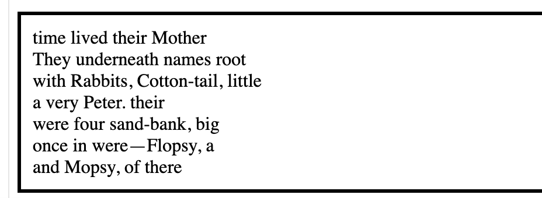
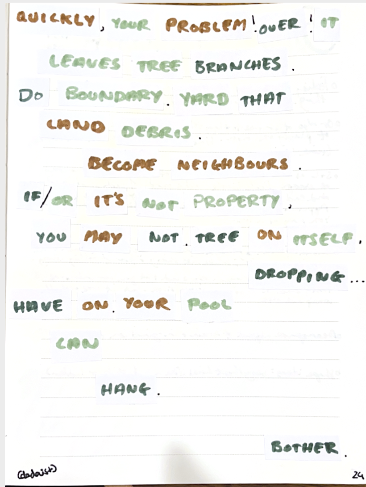
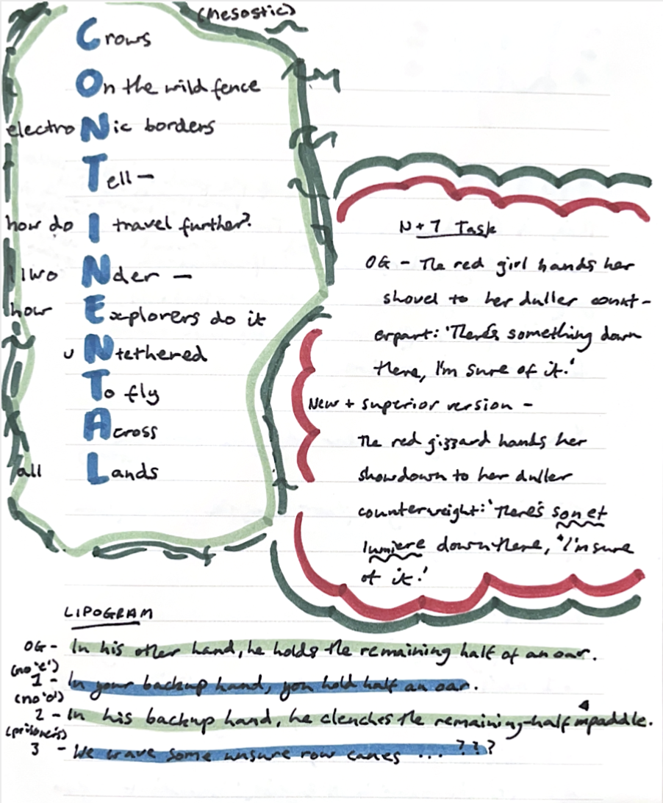
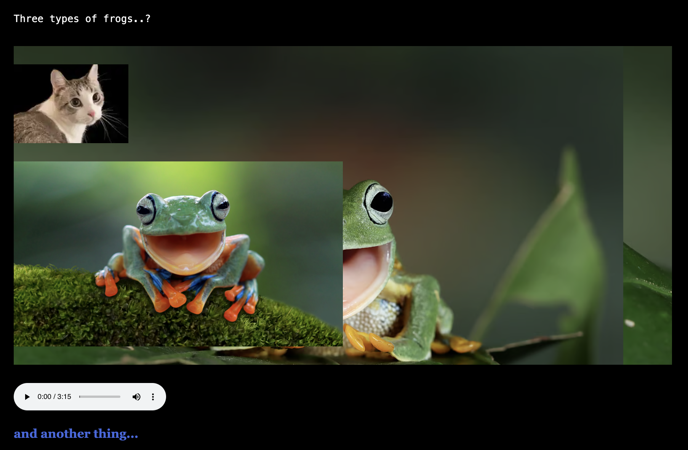

## Coding Playground
https://coding-playground-stolen-wind.vercel.app/  

  
[Reflection Here](./reflections.md)

## Constraints Poems Exercises
Dadaist Poem - Digital: https://dadaist-poem-exercise.glitch.me/  
  

Dadaist Poem - Physical:  
  

Other Poem Exercises:  

## Learning Twine
https://charlotte-b4.github.io/Learning-Twine/  
Screenshot - Screen 1  
  
Screenshot - Screen 2  
  
[Reflection Here](./reflections.md)